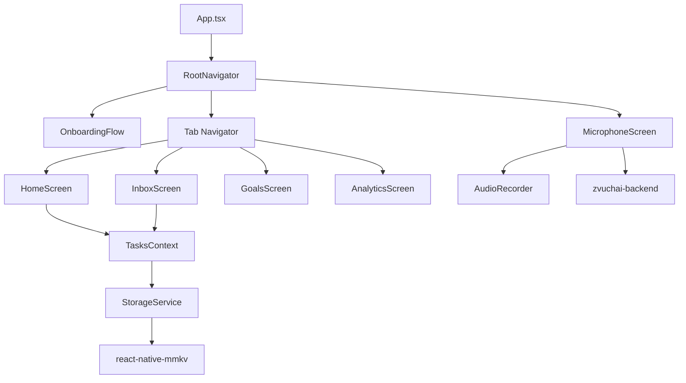

# Zvuchai Architecture State Analysis

## 1. Current Architecture and State

### Project Overview
Zvuchai is a React Native productivity application with voice‑driven task creation, scheduling, and habit tracking. The codebase is structured as a typical RN project with separate directories for screens, components, contexts, services, and navigation.

### Technology Stack
- **Frontend**: React Native 0.82.1, React 19.1.1
- **Navigation**: @react-navigation (native-stack, bottom-tabs)
- **State Management**: React Context (TasksContext, LanguageContext, SelectedDateContext, ModalContext)
- **Local Storage**: react-native-mmkv (fallback to in‑memory)
- **Audio Recording**: react-native-audio-recorder-player, @react-native-voice/voice
- **UI Components**: Custom components with Montserrat fonts, Lottie animations, SVG icons
- **Backend**: Node.js/Express server (zvuchai-backend) for audio transcription and AI parsing (Groq + Gemini/OpenRouter)

### Key Directories
```
src/
├── screens/          # Main app screens (Home, Inbox, Microphone, etc.)
├── components/       # Reusable UI components (modals, task items, calendar)
├── context/          # React Context providers
├── services/         # Business logic (StorageService, TaskCreationService, DaySummaryService)
├── storage/          # MMKV wrapper
├── navigation/       # Stack and tab navigators
├── assets/           # Fonts, icons, lottie animations
├── prompts/          # AI prompt templates
└── types/            # TypeScript definitions
```

### Core Architectural Patterns
- **Unidirectional Data Flow**: TasksContext manages all task‑related state; any modification triggers a persistence effect via StorageService.
- **Service Layer**: Pure‑JavaScript services (TaskCreationService, DaySummaryService) handle business logic, keeping UI components thin.
- **Modular Navigation**: Stack navigator wraps a bottom‑tab navigator; extra screens (Microphone) are pushed modally.
- **Voice‑First UI**: Floating Action Button (FAB) toggles between “add” and “voice” modes; voice recording launches a dedicated screen.

## 2. Relationships and Data Flow

### Component Hierarchy


### Data Flow for Voice‑to‑Task Pipeline (Current)
1. **User presses voice FAB** → `navigation.navigate('Microphone')`
2. **MicrophoneScreen** requests microphone permission, starts recording via `react-native-audio-recorder-player`.
3. **Recording stops** → `sendAudioToBackend(audioUri)` is called (currently **mocked** with a 900 ms delay).
4. **Mock response** returns a hard‑coded transcript and a task object (title, date, time, deadZoneConflict).
5. **UI updates** show the recognized text; the “tick” button is present but **has no on‑press handler**.
6. **No task is saved** to storage; the pipeline ends.

### Data Flow for Task CRUD
1. **TasksContext** loads tasks from `TaskStorage.getAll()` on mount (seeds if empty).
2. **Any state change** (add, toggle, delete, reschedule) triggers a `useEffect` that calls `TaskStorage.saveAll()`.
3. **StorageService** writes the array to MMKV under the key `tasks`.
4. **HomeScreen** filters tasks by selected date and passes them to `TaskTimelineItem`.
5. **InboxScreen** filters tasks with `date == null` (no deadline) and uses real tasks with `status === 'requires_review'` for the “AI Unsure” tab. Checkbox (toggle completion) and pencil (edit) buttons are now connected to `TasksContext` and provide visual feedback.

### Modal Windows
- **AddItemModal**: Multi‑step form for creating tasks/habits/goals; includes voice‑input integration (via `@react-native-voice/voice`).
- **EditTaskModal** / **DeleteTaskModal** / **RescheduleTaskModal**: Connected to `TasksContext.updateTask`, `deleteTask`, `rescheduleTask`.
- **CalendarRangeModal**: Custom date‑range picker used in the Inbox screen.

## 3. Missing Elements & Logic

### Voice‑to‑Task Pipeline Gaps
| Gap | Description | Impact |
|-----|-------------|--------|
| **Backend integration** | `MicrophoneScreen.sendAudioToBackend` is commented out; uses a mock delay and static response. | Voice recordings are not processed by AI; no real tasks are created. |
| **Task creation after AI parse** | The “tick” button has no `onPress` handler. The parsed task object is not passed to `TaskCreationService`. | Users cannot save voice‑recorded tasks. |
| **Error & loading states** | No UI feedback for network errors, transcription failures, or AI parsing errors. | Poor user experience; failures are silent. |
| **Confidence‑score handling** | Backend returns a `confidenceScore` but the frontend does not pass it to `TaskCreationService`. | Low‑confidence tasks are not forced into `requires_review` status. |
| **Dead‑zone conflict resolution** | The backend receives `deadZoneConflict` but the frontend does not offer a way to override. | Tasks that fall into dead zones cannot be saved. |

### Inbox Screen Gaps
| Gap | Description | Impact |
|-----|-------------|--------|
| **AI Unsure tab uses real tasks** | The tab `MAIN_TABS.AI_UNSURE` now filters real tasks with `status === 'requires_review'`. However, the voice pipeline does not yet produce such tasks, so the tab may be empty. | Users will see AI‑generated tasks needing review once the voice pipeline is integrated. |
| **Action buttons partially connected** | The checkmark (toggle completion) and pencil (edit) buttons are now connected to `TasksContext` and navigation, providing full CRUD functionality for standard tasks. The X (reject) button remains inert pending backend integration for AI‑unsure tasks. | Users can mark tasks as completed and edit them, but cannot reject AI‑unsure tasks. |
| **Connection to TasksContext established** | The Inbox now calls `setTaskCompleted` for toggle completion and navigates to `EditTaskScreen` for editing, establishing a connection to `TasksContext`. However, reject and approve actions for AI‑unsure tasks are not yet connected. | The Inbox is now partially functional for standard task management. |
| **Missing confidence display** | Real tasks currently lack a persistent `confidenceScore` field; the badge only appears for mock tasks. The confidence score is transient and not stored. | Users cannot gauge AI certainty for real tasks. |

### Main Screen ↔ LocalStorage Gaps
| Gap | Description | Impact |
|-----|-------------|--------|
| **TasksContext already connected** | HomeScreen reads `tasks` from TasksContext, which is backed by MMKV. | **No major gap** – the connection is already working. |
| **Voice‑created tasks missing** | Because the voice pipeline does not save tasks, HomeScreen never shows voice‑recorded items. | Voice input does not affect the main schedule. |
| **Date‑based filtering relies on `date` field** | Tasks without a `date` (unscheduled) do not appear in HomeScreen; they appear only in Inbox’s “No deadline” tab. | Expected behavior, but users may expect unscheduled tasks somewhere on the main screen. |

### Additional Integration Gaps
- **Backend URL configuration**: The frontend has no environment variable or config for the backend endpoint; the mocked fetch uses a placeholder `YOUR_BACKEND_URL`.
- **Audio upload format**: The backend expects `FormData` with `audio`, `currentTime`, `deadZoneConflict`; the frontend prepares this but does not send it.
- **Error boundaries**: No error boundaries around network calls; a backend failure could crash the UI.

## 4. Recommended Next Steps

### High‑Priority Fixes
1. **Integrate live backend endpoint** in `MicrophoneScreen.jsx`:
   - Uncomment the fetch block, replace `YOUR_BACKEND_URL` with the actual backend URL (e.g., `http://localhost:3000/api/process-audio`).
   - Add environment‑based configuration (e.g., `__DEV__` vs production).
2. **Connect the “tick” button** to `TaskCreationService.createTask`:
   - Pass the parsed task fields and the `confidenceScore` from the backend response.
   - Handle dead‑zone and overlap errors (show a confirmation dialog).
   - Navigate back to HomeScreen on success.
3. **Replace Inbox mock data** with real tasks:
   - Change `filteredTasks` logic to collect tasks with `status === 'requires_review'`.
   - Attach `onPress` handlers to the action buttons that call `TasksContext.updateTask` (approve → change status to `pending`), `deleteTask` (reject), and open `EditTaskModal` (edit).
4. **Add loading/error states** in MicrophoneScreen:
   - Show a spinner while uploading/processing.
   - Display error alerts if transcription or parsing fails.

### Medium‑Priority Enhancements
- **Store confidence score** (optional): Extend the `Task` type with an optional `confidenceScore` field, or keep it transient as currently designed.
- **Implement dead‑zone override**: If the backend returns a `deadZoneConflict` flag, show a confirmation dialog and allow the user to force‑save.
- **Add audio playback** in Inbox: Allow users to listen to the original voice note for tasks that have one.

### Low‑Priority / Polish
- **Refactor InboxScreen** to use a shared `TaskCard` component (currently duplicated for “no deadline” and “AI unsure” layouts).
- **Add end‑to‑end tests** for the voice pipeline.
- **Optimize storage performance** for large task lists (currently the whole array is rewritten on every change).

---

## Summary
The foundation of Zvuchai is solid: a clean React Native codebase with well‑separated concerns, a functional local‑storage layer, and a prepared backend for AI‑powered voice parsing. **The critical missing piece is the integration between the voice‑recording UI and the backend, and between the backend response and the task‑creation service.** Once those connections are made, the “Voice file → AI → Finished task” pipeline will be closed, and the Inbox will become a working review queue for low‑confidence AI suggestions. The Main Screen already connects to LocalStorage via TasksContext, so no additional work is required there.

